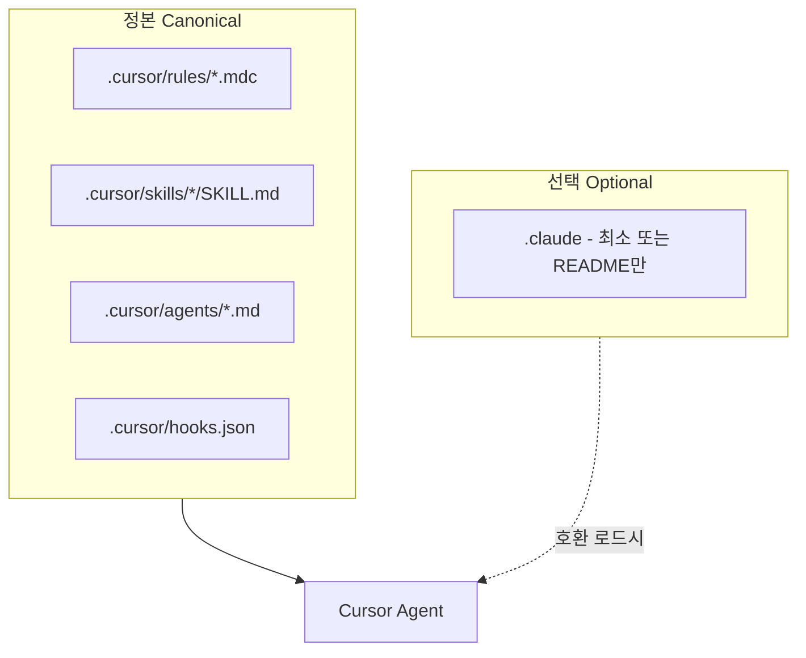

# 개요 및 공식 근거

## 1. 목적

- Claude Code 전용으로 쌓인 **`.claude`**(agents, rules, skills, hooks)와 이미 구축된 **`.cursor`**를 정리한다.
- Cursor 공식 매뉴얼에 맞춰 **프로젝트 정본을 `.cursor`에 둔다** (Rules, Skills, Subagents, Hooks).
- 중복·드리프트를 줄이고, Next.js·Flutter가 공존하는 저장소에서도 훅·룰이 서로 깨지지 않게 한다.

## 2. 공식 문서 (2026-03 기준)

| 주제 | URL | 핵심 |
|------|-----|------|
| Rules | https://cursor.com/docs/rules | `.cursor/rules`, `.mdc` + `description` / `globs` / `alwaysApply`, 또는 `AGENTS.md` |
| Skills | https://cursor.com/docs/skills | `.cursor/skills/<name>/SKILL.md`, `name`·`description` 필수; `.claude/skills`는 호환 로드 |
| Subagents | https://cursor.com/docs/subagents | `.cursor/agents/*.md`; **동일 이름이면 `.cursor`가 `.claude`보다 우선** |
| Hooks | https://cursor.com/docs/hooks | `.cursor/hooks.json`, `version: 1`, camelCase 이벤트; Claude Code 훅과 호환 언급, `CLAUDE_PROJECT_DIR` 별칭 |
| Agent Skills 표준 | https://agentskills.io/specification | 스킬 포맷 상호운용 참고 |

## 3. 목표 아키텍처

- **Single source of truth**: 구현·수정은 기본적으로 `.cursor`만 한다.
- **`.claude`**: Claude Code CLI를 팀이 계속 쓰는 경우에만 최소 유지; 내용 중복은 피하고 “`.cursor`를 따름”을 문서화한다.

## 4. 선행 작업 (이미 반영된 내부 이력)

프로젝트에는 **2026-03-10 Cursor 시스템 업그레이드**가 `.cursor`에 일부 반영되어 있다.

- 파일: `.cursor/docs/agent_upgrade/2026-03-10-cursor-system-upgrade.md`
- 요지: Rules 정비(`planner.mdc` 등), Skills 폴더 구조, Subagents `category` 등, Hooks(`afterFileEdit` + Dart 포맷), `AGENTS.md` 패턴

**이번 계획의 추가 초점**: `.claude`에만 있는 Next 스택용 **tdd 에이전트·스킬·룰·Prettier/가드 훅**을 `.cursor`로 끌어올려 **갭을 닫는 것**.

## 5. 범위 밖 (명시)

- Cursor 팀 룰·엔터프라이즈 훅 대시보드 설정 (조직 정책에 따름)
- `node_modules` 내부 `.claude` 잔여물 (무시)

## 6. 용어

- **Subagent**: Cursor 문서상 커스텀 에이전트; 저장 위치는 주로 `.cursor/agents/*.md`.
- **Project Rule**: `.cursor/rules`의 규칙; Agent 채팅 컨텍스트에 주입.
- **Skill**: 폴더 + `SKILL.md`; 에이전트가 관련 시 로드하거나 `/`로 명시 호출.
