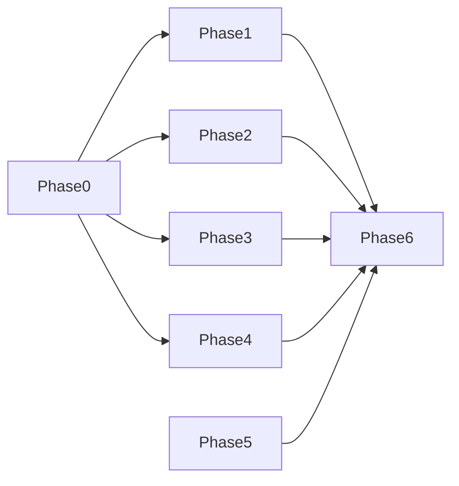

# Phase별 상세 작업서

각 Phase는 **입력 → 작업 → 산출물 → 완료 기준(DoD)** 로 정리한다.

---

## Phase 0 — 인벤토리 및 충돌 확정

| 항목 | 내용 |
|------|------|
| 입력 | [01_에이전트_스킬_룰_매핑표.md](./01_에이전트_스킬_룰_매핑표.md), 실제 디렉터리 목록 |
| 작업 | 이름 충돌 나열; “병합 / 이관 / 신규 / 유지” 태그 부여; Next vs Flutter 경계 문장화 |
| 산출물 | 매핑표 갱신(체크박스); 필요 시 `.cursor/docs/improvements/`에 인벤토리 부록 |
| DoD | 모든 `.claude` 에이전트·스킬·룰에 대해 `.cursor` 쪽 조치가 한 줄 이상 정의됨 |

**예상 공수**: 반나절 내외 (리뷰 포함)

---

## Phase 1 — Subagents (`.cursor/agents`)

| 항목 | 내용 |
|------|------|
| 입력 | `.claude/agents/tdd.md`, 중복 이름 에이전트 쌍 |
| 작업 | `tdd.md`를 `.cursor/agents/tdd.md`로 추가. YAML에서 `tools`, `maxTurns` 제거. `model`: `inherit` 또는 `fast` 등 [공식 허용값](https://cursor.com/docs/subagents)만 사용. `feature`/`ui`/`api` 등은 `.claude` 본문 중 유용한 TDD·검증 절차를 `.cursor`에 병합 |
| 산출물 | `.cursor/agents/tdd.md`; 갱신된 `feature.md` 등 |
| DoD | Cursor에서 서브에이전트 목록에 `tdd` 노출; `/tdd` 또는 자연어 위임 시 설명 필드로 라우팅 가능 |

**검토 포인트**: 기존 `.cursor/agents/feature.md`의 `model: auto`가 공식 문서와 다르면 `inherit` 등으로 통일.

---

## Phase 2 — Project Rules (`.claude/rules` → `.cursor/rules/*.mdc`)

| 항목 | 내용 |
|------|------|
| 입력 | `.claude/rules/*.md` 6종 |
| 작업 | 각 파일을 `.mdc`로 변환. `description`(Intelligent 적용 시), `globs` 또는 `alwaysApply`, 500줄 초과 시 분할. 영·한 병기 섹션 적용 |
| 산출물 | 예: `next-typescript.mdc`, `next-api-routes.mdc`, `next-react-components.mdc`, `next-testing.mdc`, `next-tdd-workflow.mdc`, `mcp-usage.mdc` (이름은 팀 컨벤션에 맞게 조정 가능) |
| DoD | Cursor Settings → Rules에서 신규 룰 인식; 편집 대상 파일에 맞게 Apply to Specific Files / Intelligent 동작 확인 |

---

## Phase 3 — Skills (`.claude/skills` → `.cursor/skills`)

| 항목 | 내용 |
|------|------|
| 입력 | `.claude/skills/*/SKILL.md` |
| 작업 | `.cursor/skills/<folder>/SKILL.md`로 복사·정리. 폴더명 = frontmatter `name`. Flutter 스킬과 역할이 겹치면 **폴더명 접두사**로 구분 (`next-ui`, `next-api` 등). `references/` 분리로 본문 길이 관리 |
| 산출물 | 이전된 스킬 폴더들 |
| DoD | Skills 목록에 중복 이름 없음; description에 “Use when …” 패턴 명확 |

**권장**: 이관 후 `.claude/skills`는 비우거나 README만 남겨 드리프트 방지.

---

## Phase 4 — Hooks

| 항목 | 내용 |
|------|------|
| 입력 | `.claude/settings.json` hooks, `.claude/hooks/prettier-format.js`, `.cursor/hooks.json`, `.cursor/hooks/format_dart.dart` |
| 작업 | [03_훅_클로드_Cursor_매핑.md](./03_훅_클로드_Cursor_매핑.md)에 따라 Cursor 이벤트에 연결. TS/Prettier는 glob/확장자 분기로 Dart 포맷과 충돌 없게 |
| 산출물 | 갱신 `.cursor/hooks.json`, 필요 시 `.cursor/hooks/*.js` |
| DoD | Hooks 탭에서 오류 없음; 샘플 편집 후 Prettier·Dart 각각 기대 경로에서 실행 |

---

## Phase 5 — AGENTS.md · 변경 로그

| 항목 | 내용 |
|------|------|
| 입력 | `.cursor/AGENTS.md`, (선택) 루트 요구사항 |
| 작업 | 루트 `AGENTS.md` 추가 여부 결정. 요약만 두고 상세는 `.cursor/AGENTS.md` 링크 문구로 위임 가능. `.cursor/docs/agent_upgrade/`에 changelog 1파일 추가 |
| 산출물 | (선택) `AGENTS.md`, `YYYY-MM-DD-claude-cursor-consolidation.md` |
| DoD | 신규 기여자가 “어디가 정본인지” 1분 안에 이해 가능 |

---

## Phase 6 — 검증

| 항목 | 내용 |
|------|------|
| 입력 | [05_검증_시나리오_체크리스트.md](./05_검증_시나리오_체크리스트.md) |
| 작업 | 항목 전부 실행 후 결과 기록 |
| 산출물 | 체크리스트 완료 표시, 이슈 티켓(있을 경우) |
| DoD | P0 시나리오 100% 통과 |

---

## 의존 관계

Phase 1~4는 병렬 가능하나, **Hooks(Phase 4)** 는 스크립트 경로 확정 후 한 번에 통합 테스트하는 것이 안전하다.
